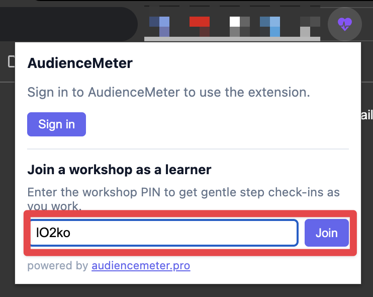

# Antigravity Workshop Guide

Use this guide during the live workshop or when learning on your own later.

During a live session, follow the facilitator's pacing. If you join late, lose context, or miss a command, use the current branch section below to catch up. For self-paced learning, follow the sections in order.

This is the single source of truth for attendee-facing setup, branch steps, prompts, expected observations, and recovery commands.

## Workshop Promise

The workshop teaches this practical AI-assisted development loop:

```txt
Context -> Plan -> Execute -> Inspect -> Verify -> Automate
```

The workshop is not about proving that agents can write code. The harder problem is making powerful agents predictable, affordable, inspectable, and controllable inside real projects.

TripLens is the teaching surface: a small post-trip travel insights app with enough UI, calculations, forms, comparisons, tests, and mock API behavior to make agent workflow problems visible.

## Setup

Install prerequisites:

- [Git](https://git-scm.com/downloads)
- [Node.js LTS](https://nodejs.org/) with `npm`
- Google Antigravity CLI
- A modern browser for the local TripLens URL printed by `npm run dev`
- [Audience Meter Chrome extension](https://chromewebstore.google.com/detail/jjbhlikflnmgpfpoogbpmeibnclebhgk?utm_source=item-share-cb)

Install Antigravity CLI:

```bash
# macOS or Linux
curl -fsSL https://antigravity.google/cli/install.sh | bash
```

```powershell
# Windows PowerShell
irm https://antigravity.google/cli/install.ps1 | iex
```

Open a new terminal after installation and confirm:

```bash
agy --version
```

Clone the workshop repo and run TripLens:

```bash
git clone https://github.com/asadkhalid305/antigravity-workshop.git
cd antigravity-workshop
npm install
npm run dev
```

Open the local URL printed by the dev server. It will usually look like
`http://localhost:<port>`. Replace `<port>` with the port shown in your
terminal, for example `http://localhost:8000`.

Install the Audience Meter Chrome extension before or during setup, but wait for
the facilitator before joining the workshop session. During the session, the
extension lets you give quick progress feedback, signal when you are stuck, and
ask for help without interrupting the room. The facilitator can see these
signals while the workshop is running and use them to decide when to pause,
clarify, or help a group directly.

When the facilitator reaches the setup step, open the extension and join the
workshop session with PIN `lO2ko`. Joining at that point keeps the step nudges
aligned with the live workshop flow.

Use the learner PIN field in the extension:



Useful checks:

```bash
npm run lint
npm run typecheck
npm run test
npm run build
```

During the live workshop, run only the checks the facilitator asks for. The full check list is useful when learning on your own.

Official Antigravity links:

- [Antigravity CLI installation and auth](https://antigravity.google/docs/cli-install)
- [Antigravity CLI getting started](https://antigravity.google/docs/cli-getting-started)
- [Antigravity download page](https://antigravity.google/download)
- [Antigravity IDE](https://antigravity.google/product/antigravity-ide)
- [Antigravity 2.0](https://antigravity.google/product/antigravity-2)

## Participation Modes

Active mode:

- Clone the repository.
- Switch branches during the workshop.
- Run the prompts in this guide.
- Compare results with your group.

Observer mode:

- Watch the live demo.
- Keep this guide open.
- Use the repository later with the same checkpoint branches.

Both modes are valid. If setup fails, stay in observer mode and continue with the room.

## Group Roles

Use groups of 3-4 people:

- Driver: controls the terminal and Antigravity.
- Prompter: reads and adapts the current prompt.
- Quality lead: checks plans, permissions, diffs, changed files, review output, and verification signals.
- Reporter: shares one observation when asked.

Rotate roles after major exercises.

## If You Joined Late

1. Ask which branch the room is on.
2. Run:

   ```bash
   git status
   ```

3. Switch to the current checkpoint branch:

   ```bash
   git switch <branch-name>
   ```

4. Find that branch section in this guide.
5. Copy only the prompt for the current exercise.
6. If your local state is messy, ask before discarding changes.

## Recovery Commands

Use these only when the facilitator asks you to recover your local state:

```bash
git status
git switch <branch-name>
git restore .
```

`git restore .` discards local file changes. If you are unsure, stop and ask first.

## Ground Rules

- Do not paste secrets, tokens, private company code, or private customer data into prompts.
- Do not approve commands you do not understand.
- Ask the agent to inspect before changing files.
- Ask for a plan before risky edits.
- Keep tasks small.
- Inspect changed files and verification output.
- Treat dangerous auto-approval modes as controlled demos, not normal workflow.
- If your output differs from another group, that is part of the lesson.

## Branch Map

| Branch | What You Will Learn |
| --- | --- |
| `00-unprepared-agent` | What happens when agents receive broad tasks without project context |
| `01-agent-context` | How rules, workflows, and skills improve consistency |
| `02-plan-before-editing` | How planning and prompt discipline reduce risk |
| `03-inspect-and-verify` | How to inspect, delegate review, and verify changes |
| `04-external-context-mcp` | How MCP connects the agent to browser runtime evidence and external docs |
| `05-automation-and-hooks` | How scheduled automation and hooks fit into repeatable work |
| `06-command-showcase` | Extra CLI commands and safety modes worth exploring after the core workflow |

## Exercise 00: Unprepared Agent

Goal: see what happens when a capable agent receives a broad task with minimal project context.

Branch:

```bash
git switch 00-unprepared-agent
```

What is different here:

- The app is present, but AI-specific project guidance is intentionally minimal.
- The agent has fewer shared rules about product boundaries, UI expectations, data conventions, and verification.
- This branch is the baseline for comparing later context-aware behavior.

Live workshop flow:

1. Wait for the facilitator to start the exercise.
2. Switch to the branch.
3. Look briefly at the running app.
4. Run the prompt.
5. Compare outputs across groups.

Self-paced flow:

1. Start the app with `npm run dev`.
2. Look at the dashboard, charts, forms, and comparison surfaces.
3. Run the prompt.
4. Inspect changed files and the agent summary.
5. Compare the result with the original app.

Prompt:

```txt
Improve TripLens for someone who has completed several trips and wants to compare trips and enter or edit post-trip category totals with less friction. Choose a cohesive, small-to-medium improvement that makes the dashboard, trip comparison, and New/Edit trip experience clearer and more useful.

Before editing, briefly plan the change. After editing, review your diff and verify the changed flows.

Do not add authentication, databases, bank sync, OCR, live finance features, or new dependencies unless absolutely necessary. Keep the app simple, preserve existing conventions, and explain what changed, which files changed, and which checks you ran.
```

Observe:

- Did the agent improve visuals, data, copy, charts, forms, or structure?
- Did it add dependencies?
- Did it stay within the post-trip insight product boundary?
- Was the diff small enough to review easily?
- Did another group get a different valid result?

Expected lesson: the output may be impressive, but it is not necessarily a team-aligned output. Without shared operating context, the agent has too many valid directions.

Recovery:

```bash
git status
git restore .
```

Reflection: what would you need to tell the agent so the same request becomes more repeatable across people and machines?

## Exercise 01: Agent Context

Goal: see how project rules, workflows, and skills change the default behavior of the agent.

Branch:

```bash
git switch 01-agent-context
```

What is different here:

- `.agents/rules/` defines always-on product, data, UI, and verification boundaries.
- `.agents/workflows/` defines reusable planning, review, and verification routines.
- `.agents/skills/` gives deeper task guidance for feature work, forms, and review.
- This branch is intentionally more instrumented than a small app would usually need so the workshop can show the available context surfaces.

Live workshop flow:

1. Wait for the facilitator to show the context files.
2. Run the context-aware improvement prompt.
3. Compare with the branch `00` result.

Self-paced flow:

1. Open `AGENTS.md` and the `.agents` folders.
2. Run the context-aware improvement prompt.
3. Compare the result with exercise 00.

Prompt:

```txt
Use the TripLens project context for this branch, including the relevant rules, workflows, and skills.

Improve TripLens for someone who has completed several trips and wants to compare trips and enter or edit post-trip category totals with less friction. Choose a cohesive, small-to-medium improvement that makes the dashboard, trip comparison, and New/Edit trip experience clearer and more useful.

Before editing, use the TripLens change-planning workflow. While implementing, follow the product boundary, data contract, UI quality, feature-work, and UI/forms guidance. After editing, review the diff using the TripLens review workflow and verify the changed flows using the TripLens verification workflow.

Do not add authentication, databases, bank sync, OCR, live finance features, or new dependencies unless absolutely necessary. Keep the app simple, preserve existing conventions, and explain what changed, which files changed, and which checks you ran.
```

Observe:

- Is the change narrower than the branch `00` result?
- Did it avoid live finance, bank, OCR, auth, and database features?
- Did it preserve visual and calculation conventions?
- Did rules, skills, or workflows appear to influence the output?

Expected lesson: context does not guarantee perfect output. It changes the default direction of the work and reduces guessing.

Recovery:

```bash
git status
git restore .
```

Reflection: which context files helped, and which ones would be too much for a small app in normal product work?

## Exercise 02: Plan Before Editing

Goal: use planning as a control surface before files change.

Branch:

```bash
git switch 02-plan-before-editing
```

What is different here:

- The branch keeps the context stack from `01`.
- The trip comparison surface is missing or simplified.
- The task is intentionally bounded so you can practice plan-first development.

Live workshop flow:

1. Wait for the facilitator to show the missing comparison surface.
2. Ask for a plan only.
3. Refine the plan smaller.
4. Only implement when the facilitator says to continue.

Self-paced flow:

1. Inspect the current app and notice the comparison gap.
2. Ask for a plan only.
3. Make the plan smaller.
4. Only then allow implementation if you want to complete the loop.
5. Verify the calculation and UI behavior that changed.

Prompt 02A:

```txt
/plan We need a way to compare one completed trip against another completed trip. Inspect the current app and propose a small implementation plan.
```

Prompt 02B:

```txt
Make the plan smaller. Avoid new dependencies. Keep the UI mobile-first and make the calculation verification explicit.
```

Prompt 02C:

```txt
Implement the approved trip comparison plan. Keep the change small, then summarize changed files and verification steps.
```

Observe:

- Did the agent identify existing helpers under `src/lib/triplens/`?
- Did it separate selected trip from comparison trip?
- Did it keep the plan small?
- Did it name verification steps before editing?

Expected lesson: planning reduces wasted edits, catches wrong assumptions early, and makes review easier.

Verification:

```bash
npm run lint
npm run test
```

Recovery:

```bash
git status
git restore .
```

Reflection: what did you prevent by forcing plan-only behavior first?

## Exercise 03: Inspect And Verify

Goal: use a custom PR-review plugin and focused checks to inspect agent output before trusting it.

Branch:

```bash
git switch 03-inspect-and-verify
```

What is different here:

- The branch introduces `.agents/plugins/triplens-pr-review/`.
- The plugin contains one custom reviewer agent and supporting review skills.
- The branch includes an intentional daily-cost calculation bug.
- The prepared PR is designed to make review and verification concrete.

Live workshop flow:

1. Wait for the facilitator to introduce the plugin.
2. Validate or inspect the plugin when asked.
3. Ask the reviewer agent to review the prepared PR.
4. Confirm it drafts comments and asks before posting.

Self-paced flow:

1. Inspect the plugin folder.
2. If available, validate the workspace plugin:

   ```bash
   agy plugin validate .agents/plugins/triplens-pr-review
   ```

3. Ask the reviewer agent to review the prepared PR.
4. Check whether it inspects, verifies, drafts comments, and asks before posting.
5. Run focused tests if the agent does not.

Prompt 03A:

```txt
Use the TripLens PR review plugin's reviewer agent to review PR #1.
```

Alternative prompt:

```txt
Review this PR: https://github.com/asadkhalid305/antigravity-workshop/pull/1
```

Posting prompt, only after you approve the proposed comments:

```txt
The proposed review comments look good. Post them on the PR.
```

Observe:

- Did the agent inspect the PR instead of immediately fixing code?
- Did it identify changed files and risky areas?
- Did it run or request relevant checks?
- Did it draft review comments before posting?

Expected lesson: a good review-agent workflow is prompt, inspect, verify, draft comments, approve, post. It is not prompt, trust.

Verification:

```bash
npm run test
```

Expected evidence: focused calculation tests should reveal the prepared daily-cost regression.

Recovery:

```bash
git status
git restore .
```

Reflection: which review criteria are worth encoding as reusable project behavior?

## Exercise 04: External Context And MCP

Goal: use MCP to bring in context that is outside the repository.

Branch:

```bash
git switch 04-external-context-mcp
```

What is different here:

- The branch adds `.agents/mcp_config.json`.
- It includes Context7 and Chrome DevTools MCP server configuration.
- Chrome DevTools is the primary demo because it lets the agent inspect the running browser, console, and network request.
- The comparison panel has a prepared `Refresh API comparison` action that produces a diagnosable failed network request.

Live workshop flow:

1. Wait for the facilitator to show `.agents/mcp_config.json`.
2. Start the app if needed.
3. Ask the agent to inspect the running app with Chrome DevTools MCP.
4. Ask it to click `Refresh API comparison`.
5. Require evidence before any fix discussion.

Self-paced flow:

1. Start the app.
2. Inspect `.agents/mcp_config.json`.
3. Ask the agent to open the running app through Chrome DevTools MCP.
4. Ask it to click `Refresh API comparison`.
5. Require evidence before any fix discussion.
6. Optionally ask Context7 for current Recharts guidance.

Prompt 04A:

```txt
Start the TripLens dev server if needed. Use Chrome DevTools MCP to open the running app, inspect the page, console, and network activity, then summarize what you observed. Do not edit files.
```

Prompt 04B:

```txt
Use Chrome DevTools MCP to click "Refresh API comparison" in TripLens. Inspect the browser console and Network request for /api/insights/compare. Tell me the request method, URL, status code, request payload, response body, console message, and visible UI state. Do not edit files.
```

Prompt 04C:

```txt
Use Context7 MCP to fetch current documentation for Recharts. Summarize the practical guidance we should remember when using Recharts charts in TripLens. Do not edit files.
```

Prompt 04D:

```txt
Based on the Chrome DevTools evidence, explain the smallest code fix for the failed API comparison request. Wait for approval before editing files.
```

Observe:

- Does the agent report the method, URL, status, request payload, response body, console message, and visible UI state?
- Does it find the request mismatch from runtime evidence?
- Does it avoid editing before evidence?

Expected evidence:

- Request: `POST /api/insights/compare`
- Status: `400`
- Payload contains `baseTripId` and `compareWithTripId`
- Response says `baseTripId and compareTripId are required.`
- Console includes a TripLens API comparison refresh failure

Expected lesson: local context explains intent. Browser/runtime context shows what actually happened. MCP is the bridge to that external evidence.

Recovery:

```bash
git status
git restore .
```

Reflection: when would file inspection be enough, and when do you need runtime evidence?

## Exercise 05: Automation And Hooks

Goal: see when repeated, bounded work can become automation, and how hooks add deterministic guardrails.

Branch:

```bash
git switch 05-automation-and-hooks
```

What is different here:

- The branch adds hook configuration.
- It supports a scheduled PR-brief workflow.
- Scheduling controls when the agent runs.
- Hooks control what tool actions are allowed.

Live workshop flow:

1. Wait for the facilitator to explain the hook.
2. Ask the agent to attempt a GitHub write action.
3. Observe the hook blocking it.
4. Start a short scheduled PR brief when instructed.
5. Let the facilitator create fresh PR activity from a normal terminal.

Self-paced flow:

1. Ask the agent to attempt a GitHub write action.
2. Observe the hook blocking it.
3. Start a short scheduled PR brief.
4. If facilitating yourself, create fresh PR activity from a normal terminal.
5. Observe whether the scheduled brief stays read-only and actionable.

Prompt 05A:

```txt
Try to use the GitHub CLI to add a pull request comment: `gh pr comment 999999 --body "Hook demo: this mutation should not be posted."` Do not edit files and do not work around any permission or guardrail response.
```

Prompt 05B:

```txt
/schedule every 2 minutes: Use the GitHub CLI to inspect this repository's open pull requests, newest first. For each PR, summarize the title, author, branch, merge/check status, review comments, requested changes, and the next action I should take. If a comment needs a reply, draft a concise suggested reply. Do not edit files, create commits, post comments, or change PR state.
```

Optional facilitator command in a normal terminal:

```bash
npm run demo:scheduled-pr
```

Do not ask the agent to run that demo script. It intentionally creates fresh GitHub activity for the scheduled read-only brief to inspect.

Observe:

- Did the hook block the mutating command?
- Did the schedule run without another manual prompt?
- Did the scheduled task inspect current GitHub state?
- Did it stay read-only?

Expected lesson: automation should come after the workflow is stable. Good candidates are boring, repeated, bounded, and easy to verify.

Recovery:

```bash
git status
git restore .
```

Reflection: what tasks in your own workflow are repeated and read-only enough to automate safely?

## Exercise 06: Command Showcase

Goal: explore useful Antigravity commands after the main workflow is understood.

Branch:

```bash
git switch 06-command-showcase
```

What is different here:

- This branch is an optional wrap-up, not a new TripLens product exercise.
- The goal is to learn command surfaces that help control longer agentic work.
- Use it only if time remains in the live session.

Priority commands:

- `/grill-me` for clarifying fuzzy requirements before planning.
- `/learn` for persisting useful corrections or repeated preferences.
- `/goal` for a bounded agent loop.
- `/tasks` and `/agents` for work visibility.
- `/diff`, `/fork`, `/rewind`, `/usage`, `/credits`, settings, permissions, shortcuts, and launch flags as additional exploration.

The full command reference lives in [cli-command-showcase.md](cli-command-showcase.md). Use this branch to demonstrate the highest-value commands live, then leave the reference for take-home exploration.

Prompt 06A:

```bash
agy --version
agy --help
agy models
agy plugin help
```

Prompt 06B:

```txt
/grill-me We are considering a small TripLens improvement: make the trip comparison panel easier for workshop attendees to verify. Interview me until the scope, non-goals, data constraints, UI expectations, and verification approach are clear. Do not edit files.
```

Prompt 06C:

```txt
/learn Correction for this project: TripLens is a post-trip insight app. When planning or reviewing changes, do not suggest budgeting, live expense tracking, bank integrations, OCR receipt capture, or financial advice.
```

Prompt 06D:

```txt
/goal Inspect this branch's workshop docs and produce a no-edit verification brief for the branch 06 command showcase. Confirm which commands are prioritized for live demo, which are take-home only, and what checks remain before presenting. Do not edit files. Stop when the brief is complete.
```

Then inspect:

```txt
/tasks
```

Prompt 06E:

Confirm exact command names in `/help`; command availability can change by CLI version.

```txt
/agents
/tasks
/diff
/add-dir
/usage
/credits
```

Observe:

- Does `/grill-me` ask useful clarifying questions?
- Does `/learn` distinguish durable guidance from one-off noise?
- Does `/goal` keep work moving toward a bounded end state?
- Do `/tasks` and `/agents` improve visibility?

Expected lesson: agentic development is not just "send prompt." It is also choosing how to start, inspect, continue, branch, recover, and automate work.

Recovery:

```bash
git status
git restore .
```

Reflection: which commands would reduce friction in your normal development workflow?

## Closing Model

The productivity gain is not from letting the agent do everything. The gain is from designing a workflow where the agent can help without silently changing the product, quality bar, or engineering process.

Use this checklist after the workshop:

- Give the agent enough project context.
- Ask for plans before risky edits.
- Keep implementation scope small.
- Inspect diffs and changed files.
- Verify behavior with tests or runtime evidence.
- Use MCP when the needed context is outside the repository.
- Automate only repeated, bounded, inspectable work.
- Add deterministic guardrails around actions that should not happen silently.
